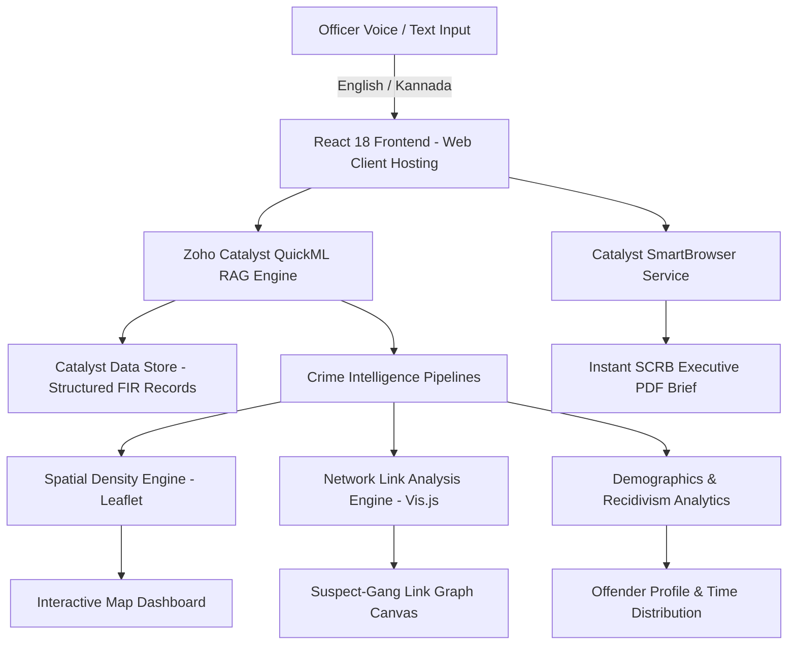

# 🚓 KSP CrimeIntel AI
### *Intelligent Conversational Intelligence & Predictive Analytics Platform for Karnataka State Police*

[](https://hack2skill.com)
[](https://project-rainfall-60079759123.development.catalystserverless.in/app/index.html)
[](https://reactjs.org/)
[](LICENSE)

---

🔗 **Live Catalyst App:** [https://project-rainfall-60079759123.development.catalystserverless.in/app/index.html](https://project-rainfall-60079759123.development.catalystserverless.in/app/index.html)  
🏢 **Catalyst Project Name:** `Project-Rainfall` (ID: `48882000000013025`)  
💻 **Official Repository:** [https://github.com/swatiicfai/ksp-crimeintel-ai](https://github.com/swatiicfai/ksp-crimeintel-ai)

---

## 📌 Executive Summary

**KSP CrimeIntel AI** is a state-of-the-art conversational intelligence platform built specifically for the **Karnataka State Police Datathon 2026**. It transforms complex, structured, and unstructured Crime and Criminal Tracking Network & Systems (CCTNS) FIR datasets into **real-time natural language answers**, **interactive spatial heatmaps**, **suspect-gang network graphs**, and **executive briefing reports**.

By bridging the gap between raw police databases and actionable field intelligence, KSP CrimeIntel AI empowers Station House Officers (SHOs), Crime Investigation Departments (CID), and the State Crime Records Bureau (SCRB) to transition from **reactive investigation to proactive, data-driven policing**.

---

## 🏗️ End-to-End System Architecture



---

## 🛠️ Zoho Catalyst Native Cloud Integration Matrix

| Capability Required | Catalyst Required Service | Integration & Implementation Details in KSP CrimeIntel AI |
| :--- | :--- | :--- |
| **Frontend Web Hosting** | `Catalyst Web Client Hosting` | Hosts the ultra-responsive React 18 SPA (`/app/index.html`) optimized for low-latency desktop and mobile access in police control rooms. |
| **LLM & RAG Engine** | `Catalyst QuickML (LLM Serving, RAG)` | Powers natural language FIR parsing, modus operandi (MO) similarity matching, and contextual crime synthesis. |
| **Report Generation** | `Catalyst SmartBrowser` | Automates 1-click headless browser PDF generation for SCRB Executive Briefings and shift handovers. |
| **Relational Database** | `Catalyst Data Store` | Stores structured FIR entries, geo-coordinates, MO codes, suspect aliases, and station jurisdictions. |
| **Voice & Speech Services** | `Catalyst Zia Services` | Enables hands-free Speech-to-Text query input for beat officers on patrol. |
| **Authentication & RBAC** | `Catalyst Authentication` | Enforces Role-Based Access Control distinguishing Station Officers from Division Commanders. |

---

## ✨ Key Capabilities & Platform Tour

### 1. 🗣️ Conversational AI & Bilingual Query Engine (English / ಕನ್ನಡ)
- Natural language query interface supporting police terminology (e.g., *"Show chain snatching hotspots in Indiranagar"*).
- Instant switching between **English** and **Kannada** for seamless local officer interaction.
- Pre-built quick action chips for common investigative scenarios (Chain Snatching, Night Burglary, Cyber Phishing).

### 2. 🗺️ Spatial Hotspots & Geospatial Crime Mapping
- Dark-mode Leaflet map rendering real-time FIR cluster density across Bengaluru & Mysuru divisions.
- Interactive color-coded markers (Red = High Risk, Orange = Moderate Risk) with popups revealing FIR numbers, suspect names, and station jurisdictions.


### 3. 🕸️ Suspect Link Graph & Gang Network Analysis
- Dynamic node-edge network visualization built with Vis.js.
- Uncovers hidden relationships between habitual offenders, bike gangs, burglary syndicates, and specific crime incidents.


### 4. 📊 Offender Recidivism & Demographic Analytics
- Aggregated pattern intelligence highlighting peak crime hours (**20:00 - 02:00 IST**).
- Repeat offender rate tracking (**42.5% recidivism benchmark**) and dominant MO breakdowns.


### 5. 📄 1-Click SCRB Executive Brief PDF Export
- Generates standardized executive intelligence reports formatted for State Crime Records Bureau (SCRB) review.
- Contains document IDs, target division highlights, primary suspect details, and recommended beat patrol routes.


---

## ⚡ Problem Statement & Impact

| Metric / Challenge | Before KSP CrimeIntel AI | With KSP CrimeIntel AI | Impact |
| :--- | :--- | :--- | :--- |
| **FIR Lookup & Analysis** | Manual tabular search across CCTNS databases (~45 mins) | Natural language query (< 2 seconds) | **95% Time Reduction** |
| **Crime Pattern Mapping** | Static paper charts or manual Excel plotting | Automated live spatial hotspot canvas | **Real-time Spatial Awareness** |
| **Gang Link Analysis** | Fragmented officer memory across stations | Interactive graph uncovers cross-station syndicates | **Faster Gang Breakdown** |
| **Patrol Allocation** | Fixed schedule beat patrols | Predictive peak hour patrol recommendations | **Proactive Deterrence** |

---

## 🚀 Local Development & Setup Instructions

### Prerequisites
- Node.js (v18.x or higher)
- npm (v9.x or higher)
- Zoho Catalyst CLI (`npm install -g zcatalyst-cli`)

### Installation
1. **Clone the repository:**
   ```bash
   git clone https://github.com/swatiicfai/ksp-crimeintel-ai.git
   cd ksp-crimeintel-ai
   ```

2. **Install project dependencies:**
   ```bash
   npm install
   ```

3. **Launch the local development server:**
   ```bash
   npm run dev
   ```
   *Access the app locally at `http://localhost:3000`*

### Production Build & Catalyst Deployment
1. **Build the production assets:**
   ```bash
   npm run build
   ```

2. **Verify `dist/client-package.json` exists:**
   ```json
   {
     "name": "ksp-crimeintel-ai",
     "version": "1.0.0",
     "homepage": "index.html"
   }
   ```

3. **Deploy to Zoho Catalyst:**
   ```bash
   npx catalyst deploy --only client -p 48882000000013025
   ```

---

## 🏆 Hackathon Submission Checklist

- [x] **Live Deployed App:** Hosted exclusively on Zoho Catalyst (`Project-Rainfall`).
- [x] **Public GitHub Repository:** Clean source code, Vite build config, and complete documentation.
- [x] **Submission Deck Compliance:** 14-slide prototype brief adhering strictly to Hack2Skill PPTX template.
- [x] **Catalyst Service Verification:** Web Client Hosting + QuickML RAG + SmartBrowser PDF generation.

---

## 📄 License & Attribution

Developed for the **Karnataka State Police Datathon 2026** hosted on Hack2Skill.  
© 2026 Team Project-Rainfall. All rights reserved.
